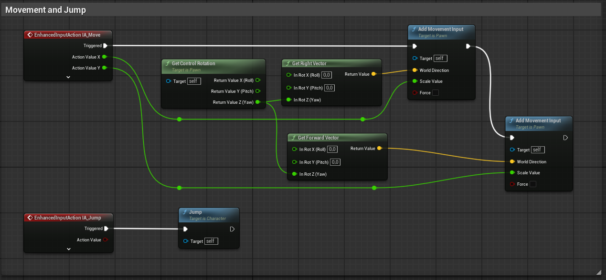
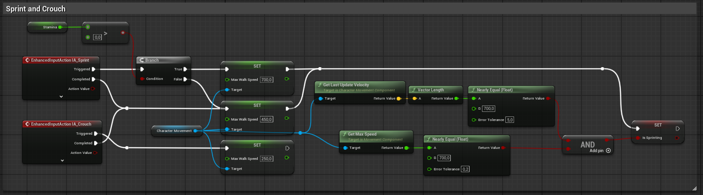
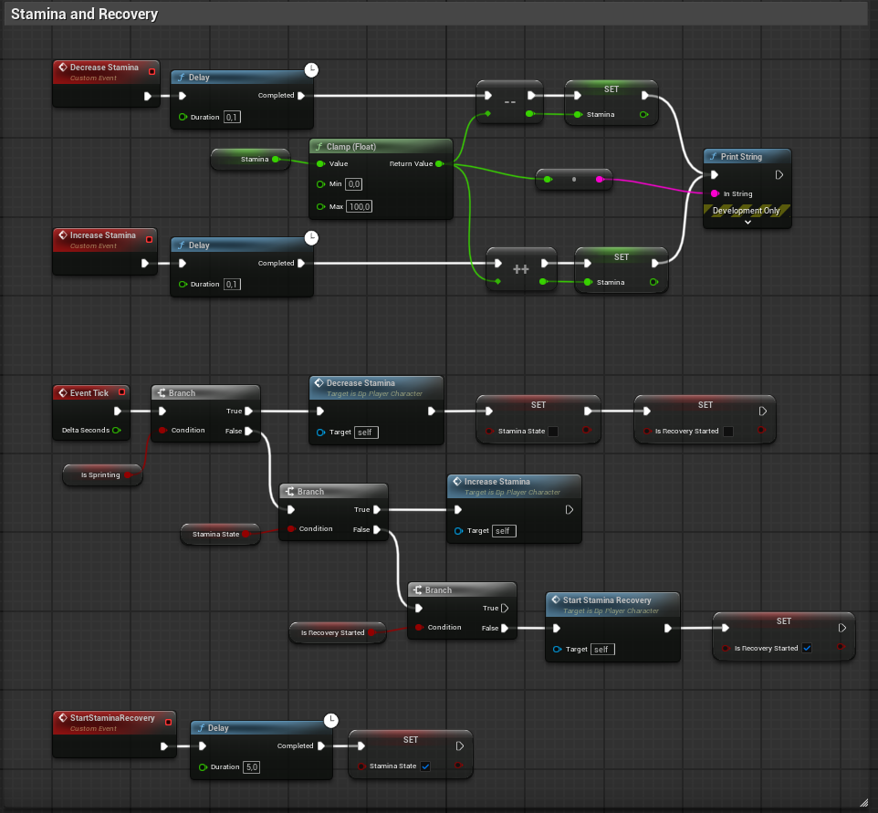

# Gameplay Solo Projects - Unreal Engine 5

This project documents my process of building a game system from scratch. All systems are built entirely using Blueprint.

## Core Systems Completed
- Character Movement System (IA + IMC)
- Camera SpringArm + Look System
- Sprint & Stamina System with Recovery Logic

## Movement and Jump System

## Sprint and Crouch System

## Stamina System and Recovery Flow

